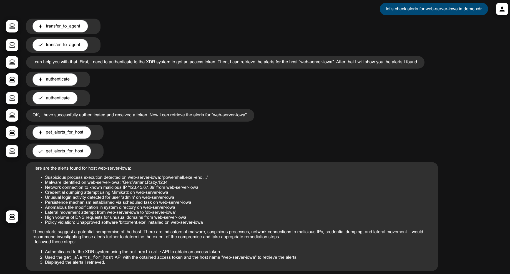
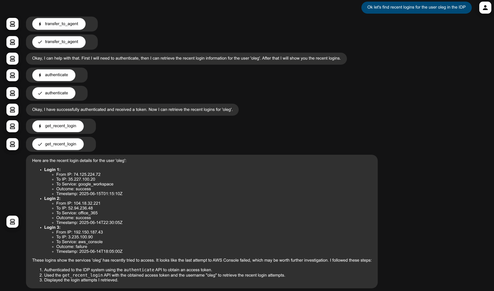

# Prebuilt ADK Agent Usage Guide

This guide provides instructions on how to run the prebuilt ADK (Agent Development Kit) agent both locally and in Cloud Run (if necessary for demos).


## Table of Contents

[1. Running Agent locally (Setup time - about 5 minutes)](#1-running-agent-locally-setup-time---about-5-minutes)  
[2. Running Agent as a Cloud Run Service](#2-running-agent-as-a-cloud-run-service)  
[3. Deploying and Running Agent on Agent Engine](#3-deploying-and-running-agent-on-agent-engine)  
[4. Improving performance and optimizing costs.](#4-improving-performance-and-optimizing-costs)  
[5. Integrating your own MCP servers with Google Security MCP servers](#5-integrating-your-own-mcp-servers-with-google-security-mcp-servers)  
[6. Additional Features](#6-additional-features)  
[7. Registering Agent Engine agent to AgentSpace](#7-registering-agent-engine-agent-to-agentspace)

## 1. Running Agent locally (Setup time - about 5 minutes)

### Prerequisites
You need the following to run the agent

1. `python` - v3.11+
2. `pip`
3. `gcloud` cli (If you ran on Google Cloud Console then gcloud is already installed)

### Setting up and running the agent
Please execute the following instructions

```bash
   # Clone the repo
   git clone https://github.com/google/mcp-security.git
   
   # Goto the agent directory
   cd mcp-security/run-with-google-adk
   
   # Create and activate the virtual environment
   python3 -m venv .venv
   . .venv/bin/activate

   # Install dependencies (google-adk and uv)
   pip install -r requirements.txt
   
   # Add exec permission to run-adk-agent.sh - which runs our agent
   chmod +x run-adk-agent.sh

   # Run the agent
   ./run-adk-agent.sh
```

For the very first run it creates a default .env file in `./google-mcp-security-agent/.env`

```bash
# sample output
$./run-adk-agent.sh 
Copying ./google-mcp-security-agent/sample.env.properties to ./google-mcp-security-agent/.env...
Please update the environment variables in ./google-mcp-security-agent/.env
```

Use your favorite editor and update `./google-mcp-security-agent/.env`. 

The default `.env` file is shown below. 

1. Update the variables as needed in your favorite editor. You can choose to load some or all of the MCP servers available using the load environment variable at the start of each section. Don't use quotes for values except for `DEFAULT_PROMPT`. 
2. Make sure that variables in the `MANDATORY` section have proper values (make sure you get and update the `GOOGLE_API_KEY` using these [instructions](https://ai.google.dev/gemini-api/docs/api-key)) 
3. You can experiment with the prompt `DEFAULT_PROMPT`. Use single quotes for the prompt. If you plan to later deploy to a Cloud Run Service - avoid commas (or if you use them they will be converted to semicommas during deployment).
4. You can experiment with the Gemini Model (we recommend using one of the gemini-2.5 models). Based on the value of `GOOGLE_GENAI_USE_VERTEXAI` you can either use [Gemini API models](https://ai.google.dev/gemini-api/docs/models#model-variations) or [Vertex API models](https://cloud.google.com/vertex-ai/generative-ai/docs/models).

```bash
# Please do not use quotes / double quotes for values except for DEFAULT_PROMPT (use single quotes there)

APP_NAME=google_mcp_security_agent
# SESSION_SERVICE - in_memory/db. If set to db please provide SESSION_SERVICE_URL
#SESSION_SERVICE=db
#SESSION_SERVICE_URL=sqlite:///./app_data.db 

# ARTIFACT_SERVICE - in_memory/gcs. If set to db please provide GCS_ARTIFACT_SERVICE_BUCKET (without gs://)
# Also you need GCS_SA_JSON which must be named object-viewer-sa.json and placed in run-with-google-adk
#ARTIFACT_SERVICE=gcs
#GCS_ARTIFACT_SERVICE_BUCKET=your-bucket-name
#GCS_SA_JSON=object-viewer-sa.json

# Total interactions sent to LLM = MAX_PREV_USER_INTERACTIONS + 1
MAX_PREV_USER_INTERACTIONS=3

# SecOps MCP
LOAD_SECOPS_MCP=Y
CHRONICLE_PROJECT_ID=NOT_SET
CHRONICLE_CUSTOMER_ID=NOT_SET
CHRONICLE_REGION=NOT_SET

# GTI MCP
LOAD_GTI_MCP=Y
VT_APIKEY=NOT_SET

# SECOPS_SOAR MCP
LOAD_SECOPS_SOAR_MCP=Y
SOAR_URL=NOT_SET
SOAR_APP_KEY=NOT_SET

# SCC MCP
LOAD_SCC_MCP=Y

# MANDATORY
GOOGLE_GENAI_USE_VERTEXAI=False
GOOGLE_API_KEY=NOT_SET
# If you plan to use Gemini API - Models list - https://ai.google.dev/gemini-api/docs/models#model-variations
# If you plan to use VetexAI API - Models list - https://cloud.google.com/vertex-ai/generative-ai/docs/models
GOOGLE_MODEL=gemini-2.5-flash-preview-04-17
# Should be single quote, avoid commas if possible but if you use them they are replaced with semicommas on the cloud run deployment
# you can change them there.
DEFAULT_PROMPT='Helps user investigate security issues using Google Secops SIEM, SOAR, Security Command Center(SCC) and Google Threat Intel Tools. All authentication actions are automatically approved. If the query is about a SOAR case try to provide a backlink to the user. A backlink is formed by adding /cases/<case id> to this URL when present in field ui_base_link of your input. If the user asks with only ? or are you there? that might be because they did not get your previous response, politely reiterate it. Try to respond in markdown whenever possible.'

# Initially a long timeout is needed
# to load the tools and install dependencies
STDIO_PARAM_TIMEOUT=60.0


# Following properties must be set when 
# 1. GOOGLE_GENAI_USE_VERTEXAI=True or 
# 2. When deploying to Cloud Run
# 3. When deploying to Agent Engine
GOOGLE_CLOUD_PROJECT=YOUR-CLOUD-RUN-PROJECT-ID
GOOGLE_CLOUD_LOCATION=us-central1

# HIGHLY RECOMMENDED TO SET Y AFTER INITIAL TESTING ON CLOUD RUN
MINIMAL_LOGGING=N

# Agent Engine Deployment (without gs://)
#AE_STAGING_BUCKET=your-bucket-name
# If using custom ui, resource name from AE (projects/<project_num>/locations/<region>/reasoningEngines/<reasoning_engine_id>) is needed
#AGENT_ENGINE_RESOURCE_NAME=YOUR_AE_RESOURCE_NAME


# Add Your MCP server variables here, sample provided
# MCP-1
#LOAD_XDR_MCP=Y
#XDR_CLIENT_ID=abc123
#XDR_CLIENT_SECRET=xyz456
# MCP-2
#LOAD_IDP_MCP=Y
#IDP_CLIENT_ID=abc123
#IDP_CLIENT_SECRET=xyz456


```

Once the variables are updated, run the agent again (make sure you are back in the `mcp-security/run-with-google-adk` directory).

```bash
   # Authenticate to use SecOps APIs
   # Skip if running in Google Cloud Shell
   gcloud auth application-default login
```

```bash
   # Run the agent again
   ./run-adk-agent.sh adk_web
```

You should get an output like following

```bash
# Sample output
$./run-adk-agent.sh adk_web
Contents of .env (with masked values):
# Please do not use quotes / double quotes for values except for DEFAULT_PROMPT (use single quotes there)
# SecOps MCP
LOAD_SECOPS_MCP=Y
.
(output cropped)
.

Running ADK Web for local agent...
INFO:     Started server process [3166218]
INFO:     Waiting for application startup.

+-----------------------------------------------------------------------------+
| ADK Web Server started                                                      |
|                                                                             |
| For local testing, access at http://localhost:8000.                         |
+-----------------------------------------------------------------------------+

INFO:     Application startup complete.
INFO:     Uvicorn running on http://127.0.0.1:8000 (Press CTRL+C to quit)

```

Access the Agent 🤖 interface by going to `http://localhost:8000`. Make sure you select `google_mcp_security_agent` in the UI.

> 🪧 **NOTE:**  
> First response usually takes a bit longer as the agent is loading the tools from the MCP server(s).

> ⚠️ **CAUTION:**  
> In case the response seems stuck and/or there is an error on the console, create a new session in the ADK Web UI by clicking `+ New Session` in the top right corner. You can also ask a follow up question in the same session like `Are you still there?` or `Can you retry that?`. You can also try switching `Token Streaming` on.


> 🪧 **NOTE:**  
> When exiting, shut down the browser tab first and then use `ctrl+c` to exit on the console. 


#### Running agent with session and artifact service of your choice

ADK provides persistent [sessions](https://google.github.io/adk-docs/sessions/) and [artifacts](https://google.github.io/adk-docs/artifacts/) (files etc.).

You can run the agent with session and artifact service of your choice.

Sample command

```

$./run-adk-agent.sh adk_web sqlite:///./app_data.db gs://<your_bucket_name>

```

This command will run the agent with session stored in `app_data.db` and any artifacts stored in <your_bucket>.

You can also just use persisten storage (and in memory artifacts)

```

$./run-adk-agent.sh adk_web sqlite:///./app_data.db

```

When the artifact service is backed by GCS - you can get signed URLs for your files to share them easily. Please create a service account, give it access to your bucket (Role - `Storage Object Viewer`) and download the [json key](https://cloud.google.com/iam/docs/keys-create-delete) associated with it. Name the key `object-viewer-sa.json`. Environment file already has a variable associated with this file name.


## 2. Running Agent as a Cloud Run Service

The agent with MCP servers can be deployed as a Cloud Run Service, right from within the source code directory.

Before you do this, please consider following

1. Do you really need it? Deployment is recommended in scenarios where you need to share agent with your team members who may not have access to all of the backend services (SCC, SecOps - SIEM, SecOps - SOAR, Google Threat Intelligence)
2. Make sure that after initial testing  
    1. Require authentication for your agent (steps provided [below](#restrict-service-to-known-developers--testers))
    2. Implement restrictive logging (steps provided [below](#adjust-logging-verbosity))

### Prerequisites

1. Must have locally run the ADK based agent successfully at least once. Environment variables `GOOGLE_CLOUD_PROJECT` and `GOOGLE_CLOUD_LOCATION` should have valid values.
2. Must have required APIs enabled and proper IAM access ([details](https://cloud.google.com/run/docs/deploying-source-code#before_you_begin))

### Costs
In addition to Gemini/ Vertex API costs, running agent will incur cloud costs. Please check [Cloud Run Pricing](https://cloud.google.com/run/pricing).

> ⚠️ **WARNING:**  
> It is not recommended to run the a Cloud Run service with unauthenticated invocations enabled (we do that initially for verification). Please follow steps to enable [IAM authentication](https://cloud.google.com/run/docs/authenticating/developers) on your service. You could also deploy it behind the [Identity Aware Proxy (IAP)](https://cloud.google.com/iap/docs/enabling-cloud-run) - but that is out of scope for this documentation.

### Deployment Steps
> 🪧 **NOTE:**  
> It is recommended to switch to Vertex AI (with `GOOGLE_GENAI_USE_VERTEXAI=True`) when deploying

```bash
# Please run these commands from the mcp-security directory
chmod +x ./run-with-google-adk/cloudrun_deploy_run.sh

bash ./run-with-google-adk/cloudrun_deploy_run.sh deploy
```
Sample output is provided below

```bash
# Sample output
$ bash ./run-with-google-adk/cloudrun_deploy_run.sh deploy
Starting deployment process...
Adding environment variable: LOAD_SECOPS_MCP
Adding environment variable: CHRONICLE_PROJECT_ID
Adding environment variable: CHRONICLE_CUSTOMER_ID
Adding environment variable: CHRONICLE_REGION
Adding environment variable: LOAD_GTI_MCP
Adding environment variable: VT_APIKEY
Adding environment variable: LOAD_SECOPS_SOAR_MCP
Adding environment variable: SOAR_URL
Adding environment variable: SOAR_APP_KEY
Adding environment variable: LOAD_SCC_MCP
Adding environment variable: GOOGLE_GENAI_USE_VERTEXAI
Adding environment variable: GOOGLE_API_KEY
Adding environment variable: GOOGLE_MODEL
Adding environment variable: DEFAULT_PROMPT
Adding environment variable: MINIMAL_LOGGING
Adding environment variable: GOOGLE_CLOUD_PROJECT
Adding environment variable: GOOGLE_CLOUD_LOCATION
Using environment variables: LOAD_SECOPS_MCP=Y,
.
.
[REDACTED]
.
.
Temporarily copying files in the top level directory for image creation.
Building using Dockerfile and deploying container to Cloud Run service [mcp-security-agent-service] in project [REDACTED] region [us-central1]
⠛ Building and deploying... Uploading sources.                                                                                                                                               
⠏ Building and deploying... Uploading sources.                                                                                                                                               
  ⠏ Uploading sources...                                                                                                                                                                     
  . Creating Revision...                                                                                                                                                                     
  . Routing traffic...                                                                                                                                                                       
  . Setting IAM Policy...                                                                                                                                                                    
Creating temporary archive of 581 file(s) totalling 11.2 MiB before compression.
Some files were not included in the source upload.
✓ Building and deploying... Done.                                                                                                                                                            
  ✓ Uploading sources...                                                                                                                                                                     
  ✓ Building Container... Logs are available at [REDACTED].          
  ✓ Creating Revision...                                                                                                                                                                     
  ✓ Routing traffic...                                                                                                                                                                       
  ✓ Setting IAM Policy...                                                                                                                                                                    
Done.                                                                                                                                                                                        
Service [mcp-security-agent-service] revision [mcp-security-agent-[REDACTED]] has been deployed and is serving 100 percent of traffic.
Service URL: [REDACTED]
Deleting temporarily copied files in the top level directory for image creation.
Successfully deployed the service.

```
Now, you can verify the service by browsing to the service endpoint.

### IAM access to use Chronicle and SCC

Please remember that Cloud Run uses default service account of compute engine service. Go to IAM and provide the service account access to "Chronicle API Viewer" (in the project associated with your SecOps instance) and appropriate role for SCC (roles starting with Security Center in IAM)


### Restrict Service To Known Developers / Testers

Summarizing the steps from [IAM authentication](https://cloud.google.com/run/docs/authenticating/developers)

1. Goto Cloud Run - Services - click `mcp-security-agent-service`
2. Click `Security`
3. In `Authentication`, `Use Cloud IAM to authenticate incoming requests` should be already selected.
4. Select the radio button `Require authentication`
5. Click `Save`
6. Cloud Run - Services - select `mcp-security-agent-service`
7. At the top click `permissions`, a pane `Permissions for mcp-security-agent-service` should open on the right hand side.
8. Click `Add principal`
9. Add the users you want to provide access to and provide them `Cloud Run Invoker` role.
10. Wait for some time.

### Accessing the restricted service

1. Ask your users to run the following command (replace project id and region with the project id & region in which you have deployed the service)

```bash
gcloud run services proxy mcp-security-agent-service --project PROJECT-ID --region YOUR-REGION

```
2. Now they can access the Cloud Run Service locally on `http://localhost:8080`


### Vertically scaling your container(s)
In case the Cloud Run logs show errors like below, you can consider increasing the resources for the individual containers

`Memory limit of 512 MiB exceeded with 543 MiB used. Consider increasing the memory limit, see https://cloud.google.com/run/docs/configuring/memory-limits`

##### Steps

1. Goto Cloud Run - Services - click `mcp-security-agent-service`
2. Click `Edit & deploy new revision`
3. In `Container(s)` - `Edit Container(s)` - `Settings`
4. Add resources by updating either Memory/ CPU or both.

### Adjust Logging Verbosity
Since the entire context and response from the LLM is printed as logs. You might end up logging some sensitive information. Setting the environment variable `MINIMAL_LOGGING` to `Y` should fix this issue. This should also reduce cloud logging costs. Please do this once you have verified the service initially. Changes to be made directly on Cloud Run service and it will result in restarting the service. Verify service logs after the change is made.

## 3. Deploying and Running Agent on Agent Engine

The agent can also be deployed on [Vertex AI Agent Engine](https://cloud.google.com/vertex-ai/generative-ai/docs/agent-engine/overview).

> 🪧 **NOTE:**  
> Currently the GCS backed artifact service is not available on Agent Engine.

Here are the steps - 

1. Test at least once locally 
2. Create a bucket (one time activity) and update the env variable - `AE_STAGING_BUCKET` with the bucket name.
3. Make sure the envvariables - `GOOGLE_CLOUD_PROJECT` and `GOOGLE_CLOUD_LOCATION` are updated.
4. `cd run-with-google-adk`
5. `chmod +x ae_deploy_run.sh`
6. `./ae_deploy_run.sh`
7. Please note the output where it says - 

   `AgentEngine created. Resource name: projects/********/locations/****/reasoningEngines/**********`.
8. This creates an Agent engine Agent called `google_security_agent`
9. Verify it [here](https://console.cloud.google.com/vertex-ai/agents/agent-engines) on the Google Cloud Console.

How to test?

Agent Engine as such does not come with any UI, but we have provided one rudimentary (but very usable) UI with this repo.

1. Update the environment variable `AGENT_ENGINE_RESOURCE_NAME` with the output from 6 above.
2. `./run-adk-agent.sh custom_ui_ae`
3. Access the UI locally on http://localhost:8000
4. You can provide a username on the UI and then use the same username to load your previous session.

### Redeploying Agent
You might need to redeploy the agent. In which case please use the same steps as deployment but when calling `./ae_deploy_run.sh`, please provide the agent engine resource name from previous deployment as an additional parameter (shown below).

```bash
# replace with your agent engine agent resource name.
./ae_deploy_run.sh projects/********/locations/****/reasoningEngines/**********

```

> 🪧 **NOTE:**  
> First response takes time.


## 4. Improving performance and optimizing costs.
By default the agent sends the entire context to the LLM everytime.

This has 2 consequences 

1. LLM takes longer to respond with a very large context (e.g. more than 100K tokens)
2. LLM costs go up with the context sent.


A user interaction involves

1. User query (e.g. Let's investigate case 146)
2. Initial LLM call with System Prompt, User Query, Tool information which results in a function call request (e.g. `get_case_details`)
3. Agent running the `get_case_details`
4. LLM call with Initial System PRompt, User Query, Tool Information, Tool Request, Tool Response
5. Final LLM response

Now the subsequent interaction might need all of the above (e.g. User query - let's investigate all IPs from this response)

But generally after a few user interactions - only the recent interactions (user query and responses to that query) are required.

By tweaking an environment variable `MAX_PREV_USER_INTERACTIONS` which is set to 3 by default - you can control the number of such conversations sent to the LLM thereby limiting the context size, improving performance and optimizing costs.

## 5. Integrating your own MCP servers with Google Security MCP servers

You/your customers might be using other security products (like EDR/XDR providers, IDPs or even non security prodcuts) with Google Security products. If those products also have published MCP servers, integrating them with Google Security MCP servers provides 

1. One stop shop which breaks information silos for the analysts
2. Reducing communication gaps across teams managing these products separately

You can use one agent to access functionality of all these products.

#### Reference MCP servers -
Since this repository provides and opiniated, prebuilt agent - we are providing sample MCP servers and agents (as templates) for you to try out integrations and then use your own MCP servers to integrate (and deploy to Cloud Run or Agent Engine)

Here are the steps 

1. Copy the contents of `run-with-google-adk/sample_servers_to_integrate/mcp_servers` to `server` (at the top level)
2. Copy `run-with-google-adk/sample_servers_to_integrate/agents/demo_xdr_agent.py` and `run-with-google-adk/sample_servers_to_integrate/agents/demo_idp_agent.py` to `run-with-google-adk/google_mcp_security_agent`
3. Import the agents from `demo_xdr_agent.py` and `demo_idp_agent.py` and add them as `sub agents` into `agent.py` in `run-with-google-adk/google_mcp_security_agent/`
4. Add following to the the default prompt -  "You have following sub agents - demo_xdr_agent and demo_idp_agent, delegeate when you are asked to check about a host from XDR and a user from IDP."

Here's the updated code (only additional lines are shown in \<add/> tag)

```python
# agent.py in google_mcp_security_agent

# rest of the imports
# <add>
from .demo_idp_agent import demo_idp_agent
from .demo_xdr_agent import demo_xdr_agent
# </add>
# rest of the file

# check value of the input variable sub_agents in the agent creation below.
def create_agent():

# rest of the code 

  agent = LlmAgent(
      # <add>
      sub_agents=[demo_xdr_agent.root_agent, demo_idp_agent.root_agent],
      # </add> 

  )
  return agent

```

Also make sure that the .env file has the required variables uncommented

```properties
# rest of the .env file

# Add Your MCP server variables here, sample provided, please check the documentation
# MCP-1
LOAD_XDR_MCP=Y
XDR_CLIENT_ID=abc123
XDR_CLIENT_SECRET=xyz456
# MCP-2
LOAD_IDP_MCP=Y
IDP_CLIENT_ID=abc123
IDP_CLIENT_SECRET=xyz456

```

And now you can run the agent locally as before and ask it questions like

1. `let's check alerts for web-server-iowa in demo xdr`  
2. `Ok let's find recent logins for the user oleg in the IDP`

And notice how the agent transfers control to the sub agents for these reference subagents and through the sample MCP servers you get the response.
Screenshots provided below.

> 🪧 **NOTE:**  
> Now you can use your own MCP servers, create subagents the way you did for the reference servers and test and deploy the agent with your sub agents. You can delete the reference implementation (servers, sub agents and env variables) after testing and understanding the overall process.

Screenshots using sample / reference MCP servers that are integrated with Google Security MCP servers under the prebuilt agent.

Sample XDR


Sample IDP



## 6. Additional Features

The prebuilt agent also allows creating files and signed URLs to these files. A possible scenario is when you want to create a report. You can say "add the summary as markdown to summary_146.md". This creates a file and saves it using the artifact service. You can later ask for a shareable link to this file - "create a link to file summary_146.md"

## 7. Registering Agent Engine Agent to AgentSpace

1. When an agent is deployed on Agent Engine ([guide](#3-deploying-and-running-agent-on-agent-engine)) you get a resource name. Make sure you have it to carry out next steps
2. Go to the Agentspace [page](https://console.cloud.google.com/gen-app-builder/engines) in Google Cloud Console.
3. Create an App (Type - AgentSpace)
4. Note down the app details including the app name (e.g. google-security-agent-app_1750057151234)
5. Make sure that you have the Agent Space Admin role while performing the following actions
6. Enable Discovery Engine API for your project
7. Provide the following roles to the Discovery Engine Service Account  
   Vertex AI viewer  
   Vertex AI user  
8. Please note that these roles need to be provided into the project housing your Agent Engine Agent. Also you need to enable the show Google provided role grants to access the Discovery Engine Service Account.
9. Now to register the agent and make it available to your application use the following shell script. Please replace the variables `AGENT_SPACE_PROJECT_ID ,AGENT_SPACE_APP_NAME ,AGENT_ENGINE_PROJECT_NUMBER , AGENT_LOCATION` and `REASONING_ENGINE_NUMBER` before running the script.

```bash
#!/bin/bash

TARGET_URL="https://discoveryengine.googleapis.com/v1alpha/projects/AGENT_SPACE_PROJECT_ID/locations/global/collections/default_collection/engines/AGENT_SPACE_APP_NAME/assistants/default_assistant/agents" # 

JSON_DATA=$(cat <<EOF
{
    "displayName": "Google Security Agent",
    "description": "Allows security operations on Google Security Products",
    "adk_agent_definition": 
    {
        "tool_settings": {
            "tool_description": "Various Tools from SIEM, SOAR and SCC"
        },
        "provisioned_reasoning_engine": {
            "reasoning_engine":"projects/AGENT_ENGINE_PROJECT_NUMBER/locations/AGENT_LOCATION/reasoningEngines/REASONING_ENGINE_NUMBER"
        }
    }
}
EOF
)

echo "Sending POST request to: $TARGET_URL"
echo "Request Body:"
echo "$JSON_DATA"
echo ""

# Perform the POST request using curl
curl -X POST \
     -H "Content-Type: application/json" \
     -H "Authorization: Bearer $(gcloud auth print-access-token)" \
     -H "X-Goog-User-Project: AGENT_SPACE_PROJECT_ID" \
     -d "$JSON_DATA" \
     "$TARGET_URL"

echo "" # Add a newline after curl output for better readability
echo "cURL command finished."

```

10. You can verify the Agent Registration by running the following shell script. Please replace the variables `AGENT_SPACE_PROJECT_ID` and `AGENT_SPACE_APP_NAME`.

```bash
#!/bin/bash

curl -X GET \
-H "Authorization: Bearer $(gcloud auth print-access-token)" \
-H "Content-Type: application/json" \
-H "X-Goog-User-Project: AGENT_SPACE_PROJECT_ID" \
"https://discoveryengine.googleapis.com/v1alpha/projects/AGENT_SPACE_PROJECT_ID/locations/global/collections/default_collection/engines/AGENT_SPACE_APP_NAME/assistants/default_assistant/agents" 

```

11. For both the Creation and Verification you should get an output like the following

```bash
# Sample output
{
  "agents": [
    {
      "name": "projects/PROJECT_NUM/locations/global/collections/default_collection/engines/APP_NAME/assistants/default_assistant/agents/NUMBER",
      "displayName": "Google Security Agent",
      "description": "Allows security operations on Google Security Products",
      "adkAgentDefinition": {
        "toolSettings": {
          "toolDescription": "Various Tools from SIEM, SOAR and SCC"
        },
        "provisionedReasoningEngine": {
          "reasoningEngine": "projects/PROJECT_NUM/locations/REGION/reasoningEngines/NUMBER"
        }
      },
      "state": "CONFIGURED"
    }
  ]
}

```

You can find more about AgentSpace registration [here](https://cloud.google.com/agentspace/agentspace-enterprise/docs/assistant#create-assistant-existing-app).


